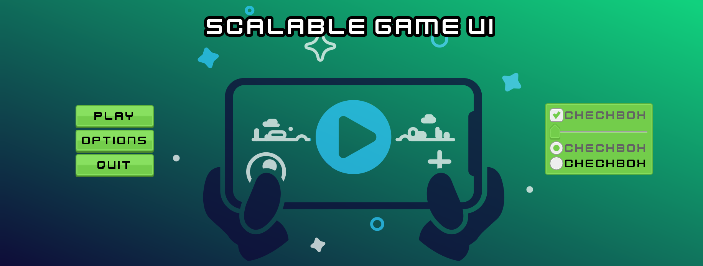

# Scalable UI template project

This project is a Godot template project for testing the concepts explained in [this blog post](https://ramatak.com/blog/).

There are two scripts, `Control.gd` and `Control2.gd` that can be tested directly in the main scene.

The art for the theme used in this project was made by [Kenney](https://kenney.nl/assets/ui-pack) and you can get the ready-to-use themes from [here](https://azagaya.itch.io/kenneys-ui-theme)
